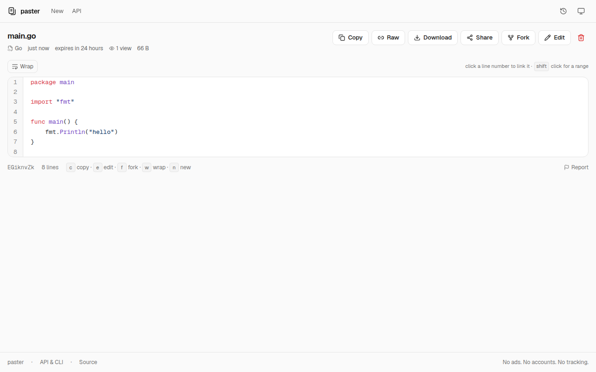

# pastr

Paste text, get a link, decide when it disappears. Hosted at [pastr.xditya.me](https://pastr.xditya.me).

pastr is a small pastebin that runs on Vercel and Upstash Redis. It highlights 70 languages, encrypts in the browser when you ask it to, and deletes pastes exactly when they expire. There are no accounts, ads or trackers; your own pastes are remembered in your browser so you can edit or delete them later.

[](https://vercel.com/new/clone?repository-url=https%3A%2F%2Fgithub.com%2Fxditya%2Fpastr&env=UPSTASH_REDIS_REST_URL,UPSTASH_REDIS_REST_TOKEN&envDescription=Create%20a%20free%20Redis%20database%20at%20console.upstash.com%20and%20paste%20its%20REST%20URL%20and%20token.&envLink=https%3A%2F%2Fconsole.upstash.com&project-name=pastr&repository-name=pastr)



## What you get

- **Short links**: paste a single URL and `/{id}` redirects to it; `/{id}+` shows where it goes first.
- **Link previews everywhere**: the site has its own social card, text pastes preview their first lines, image pastes unfurl as the image, short links show their destination.

- Syntax highlighting rendered on the server with shiki, in light and dark, with linkable line ranges, a wrap toggle and rendered Markdown. Pages work without JavaScript.
- Expiry from 10 minutes to never, enforced by a Redis TTL instead of a cleanup job. Burn-after-read pastes are destroyed the moment someone opens them.
- Optional end-to-end encryption (AES-256-GCM). The key lives after the `#` in the link or is derived from a password; the server only ever sees ciphertext, including the title and language.
- A terminal-first API. `curl --data-binary @file host/api/v1/pastes` prints a link. The `pastr` CLI (npm, or a curl-installable shell script) pastes from stdin, files or the clipboard. hastebin clients keep working.
- Images too: paste a screenshot into the editor, drop a PNG, JPEG, GIF or WebP, or run `pastr shot.png` (`pastr clip` picks up an image on the clipboard). Images are capped at 700 KB and `/raw` serves them with their media type.
- A warning before you leak something: the editor flags text that looks like an API key, private key, JWT or password.
- Operator tools: an admin listing of recent and most-reported pastes, abuse reports with a webhook, and an expiry cap.

pastr replaces [pasty](https://github.com/xditya/pasty). The look borrows the tokens of [engram](https://engram.xditya.me): three greys, one accent, hairlines instead of shadows, Geist and Geist Mono.

## Deploy

1. Create a Redis database at [console.upstash.com](https://console.upstash.com), or add Upstash for Redis from the Vercel Marketplace, which sets the variables for you.
2. Import this repository in Vercel with the Next.js preset. The build needs no changes.
3. Set `UPSTASH_REDIS_REST_URL` and `UPSTASH_REDIS_REST_TOKEN` (the Marketplace's `KV_REST_API_URL` and `KV_REST_API_TOKEN` also work). Everything else is optional; see [`.env.example`](.env.example).
4. Deploy. Expiry is Redis TTL, so there is no cron job to set up.

Any host that runs Next.js works the same way. If you run the Node server yourself, put it behind a reverse proxy that appends `X-Forwarded-For` and set `TRUSTED_PROXY_HOPS` to the number of proxies; the rate limiter needs a real client address.

## Develop

```sh
pnpm install
pnpm dev        # http://localhost:3000, in-memory store when no Redis credentials are set
pnpm check      # lint, typecheck, unit tests, build
```

End-to-end checks run against a built server:

```sh
ALLOW_MEMORY_STORE=1 DISABLE_RATE_LIMIT=1 PORT=3111 pnpm start &
BASE=http://localhost:3111 bash scripts/smoke.sh                              # API contract, curl
CHROMIUM_PATH=/path/to/chromium BASE=http://localhost:3111 node e2e/ui.mjs    # browser flows and screenshots
```

To add a language, append it to `src/lib/langs.ts` and run `pnpm gen:grammars`.

## CLI

The CLI lives in [`cli/`](cli/) and is published to npm as `@xditya/pastr` (the bare name is blocked by npm as too close to `astro` and friends); the binary is still `pastr`. Every instance also serves a POSIX shell version with its own host baked in.

```sh
npm install -g @xditya/pastr                                        # Node 20+, supports -E encryption
pastr config host https://your-host                                 # only for your own instance; pastr.xditya.me is the default
curl -fsSL https://your-host/install.sh | sh                        # sh + curl, no Node

ls -la | pastr                 # stdin
pastr main.go -e 1d            # a file, language from the extension
pastr clip -E -c               # clipboard, encrypted, link copied back
pastr text "hello" -b          # burn after read
pastr get URL#key              # print, decrypting if needed
pastr ls                       # browse your pastes: ↑↓ or click, enter reveals the edit token, again copies it
pastr rm ID                    # delete with the locally stored edit token
pastr token ID                 # show that token, for the site's Edit/Delete prompt
```

## API

Everything the site does is available over HTTP. A running instance documents it at `/docs`.

```sh
# create; terminal clients get the URL as text, JSON clients get JSON
cat main.go | curl --data-binary @- 'https://your-host/api/v1/pastes?name=main.go&expires=1d'

# read, raw, download
curl https://your-host/api/v1/pastes/ID
curl https://your-host/ID/raw
curl -O 'https://your-host/ID/raw?dl=1'

# edit and delete need the edit token returned on create
curl -X PATCH -H 'Authorization: Bearer TOKEN' -H 'Content-Type: application/json' \
     -d '{"content":"new"}' https://your-host/api/v1/pastes/ID
curl -X DELETE -H 'Authorization: Bearer TOKEN' https://your-host/api/v1/pastes/ID

# hastebin-compatible
curl --data-binary @file https://your-host/documents
```

## How it works

Creating a paste starts in the editor on `/`. The language is detected from the content or the filename, and you pick expiry, burn-after-read and encryption. With encryption on, the browser encrypts `{title, lang, content}` before anything leaves the page: link mode puts a random 256-bit key in the URL fragment, password mode derives one with PBKDF2. `POST /api/v1/pastes` validates the body, allocates an 8-character id, hashes a fresh edit token and writes the record to Redis with a TTL equal to the expiry. The response carries the edit token once; the browser keeps it, and the link key, in `localStorage` under "Your pastes", then navigates to `/{id}.{lang}#key`.

Reading one is a server component. `GET /{id}` peeks the record, then (unless it is burn-after-read) runs one atomic Redis script that reads the paste and increments its view counter. Plain pastes are highlighted on the server and streamed as HTML. Encrypted pastes arrive as ciphertext; the browser decrypts with the fragment key or asks for the password, then highlights locally. Burn-after-read pastes show a gate, and only clicking "Reveal and destroy" calls the API, which reads and deletes in one step. Link-preview bots never burn anything, and `HEAD` requests never count a view.

Editing and deleting send `Authorization: Bearer <editToken>`. Only the SHA-256 of the token is stored, and an edit preserves the original expiry.

### Stack

| Layer | Choice | Why |
| --- | --- | --- |
| Framework | Next.js 16 (App Router), React 19, TypeScript | Server components for fast reads that work without JS; route handlers for the API |
| Storage | [Upstash Redis](https://upstash.com) over REST | Connectionless, free tier, native TTL gives exact expiry |
| Rate limiting | `@upstash/ratelimit` sliding window | Shared across serverless instances |
| Highlighting | shiki 4 with the JavaScript regex engine and lazy grammars | Accurate TextMate grammars, light and dark in one pass, no WASM |
| Styling | Tailwind CSS 4 with a small token set | Light and dark themes, no component library |
| Crypto | Web Crypto AES-GCM and PBKDF2 | Authenticated encryption, built into every browser |

### Redis layout

| Key | Type | Notes |
| --- | --- | --- |
| `p:{id}` | JSON string | The paste record; TTL is the expiry |
| `v:{id}` | integer | View counter, TTL copied from the paste |
| `r:{id}` | list | Abuse reports, 30-day TTL |
| `s:created`, `s:views` | integer | Global counters for `/api/v1/info` |
| `rl:*` | | Rate-limit buckets |

A page view costs two REST round trips (a peek pipeline, then one Lua script that reads, counts the view, copies the TTL onto the counter and burns if needed). An API read is one round trip; a create is a rate-limit check plus one write. Upstash's free tier of 500k commands a month covers a personal instance comfortably.

## Security model

- Edit tokens are 256-bit random values. Only their SHA-256 is stored, and comparison is constant-time.
- Encrypted pastes hide the title and language as well as the content. `/raw` returns the ciphertext with an `X-Encrypted: 1` header.
- `Referrer-Policy: no-referrer` keeps URL fragments (keys) out of outgoing requests. A nonce-based CSP (`script-src 'self' 'nonce-…' 'strict-dynamic'`) is set on every response, every paste carries `X-Robots-Tag: noindex`, and framing is only allowed for `?embed=1` paste pages.
- Per-IP sliding-window rate limits cover create, read (API, pages and OG images), mutate and report. Request bodies are capped while streaming rather than trusting `Content-Length`; content is capped at 1 MiB (images at 700 KB before base64) and titles at 120 characters.
- Encrypted pastes can only be updated with fresh encryption metadata, so an IV is never reused.
- Burn-after-read runs as one atomic Lua script, so two readers can never both see the content.
- Reports store a salted hash of the reporter's IP for 30 days, never the IP itself. They can be forwarded to a webhook with mentions disabled. `ADMIN_TOKEN` lets an operator delete anything.
- `HEAD` requests never count views or burn pastes, so link checkers are safe. Every `GET` that returns content does consume a burn-after-read paste.

## Compared with pasty

| | pasty | pastr |
| --- | --- | --- |
| Expiry | one global lifetime, cron cleanup | per paste, exact TTL, plus burn-after-read |
| Encryption | AES-CBC, key in fragment | AES-GCM (authenticated), key in fragment or password |
| Highlighting | highlight.js auto-detect | shiki with a language picker and filename detection |
| Line links, wrap, Markdown, OG previews | no | yes |
| Edit and delete | paste the token into `prompt()` | remembered per browser, token dialog as fallback |
| Titles, downloads, forking, share and QR | no | yes |
| Hosting | Go binary plus Postgres, Mongo or S3 | Vercel plus Upstash |

## License

MIT
